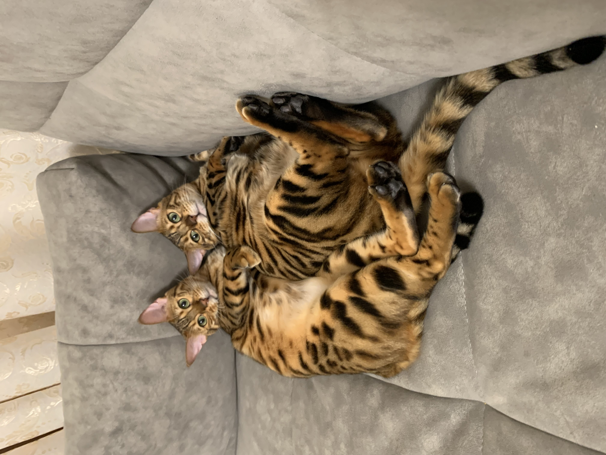

# Работа на семинаре 2

# Основные команды Git
git init - инициализация нового репозитория
git clone - клонирование репозитория, если проект настроен в центральном репозитории
git add - добавить файл в репозиторий (команда git add --all добавляет все неотслеживаемые файлы в репозиторий и обновляет дерево изменений репозитория)
git config - настройка конфигурациию
git push - отправка изменений в удаленный репозиторий.

добавляем информацию про деревья

Информация из ветки master

